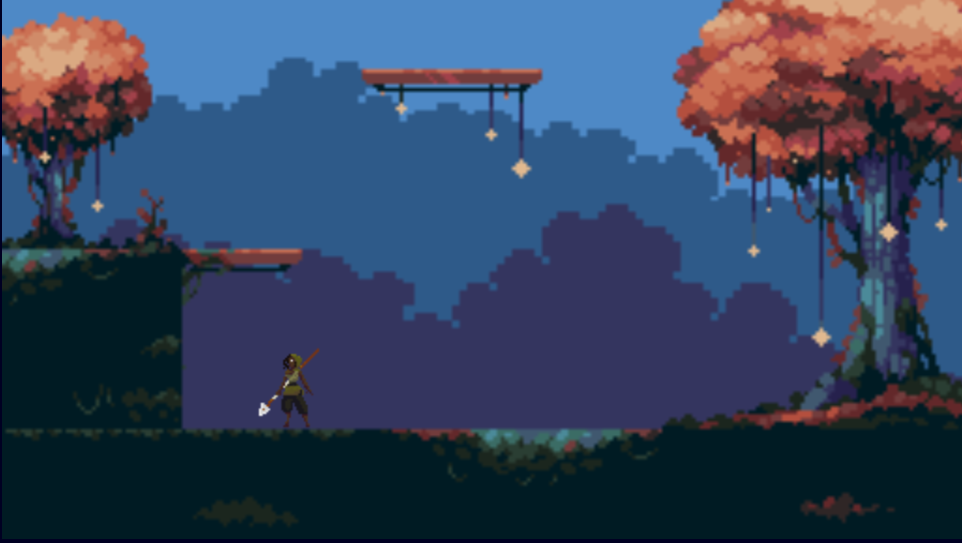

# Harvest Hunter - Vertical Platformer Game

## Table of contents

- [Overview](#overview)
  - [Gameplay](#gameplay)
  - [Screenshot](#screenshot)
  - [Links](#links)
- [My process](#my-process)
  - [Built with](#built-with)
  - [Useful resources](#useful-resources)
- [Author](#author)

## Overview

Work In Progress - creating a vertical platformer where the player collects forest items and fights enemies

### Gameplay

- Use the arrow keys (left, right, up) to move the hunter around

### Screenshot

### Links

- Live Site -> 

## My process

### Built with

- HTML 
- CSS
- Vanilla JavaScript

### Useful resources

- [Chris Courses](https://chriscourses.com/) - Tutorial 

## Author

- Website - [Natasha Chambers Portfolio](https://natashaagathachambers.com/)